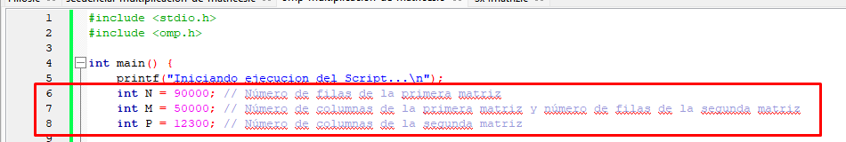
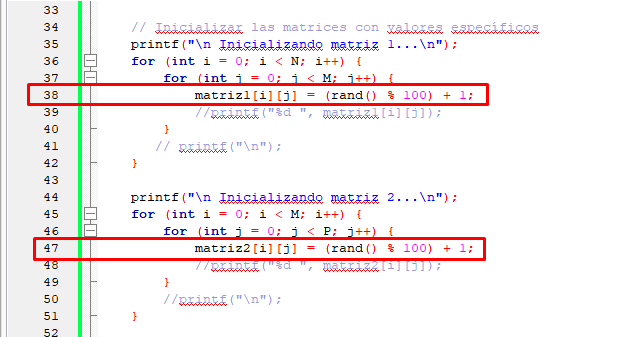
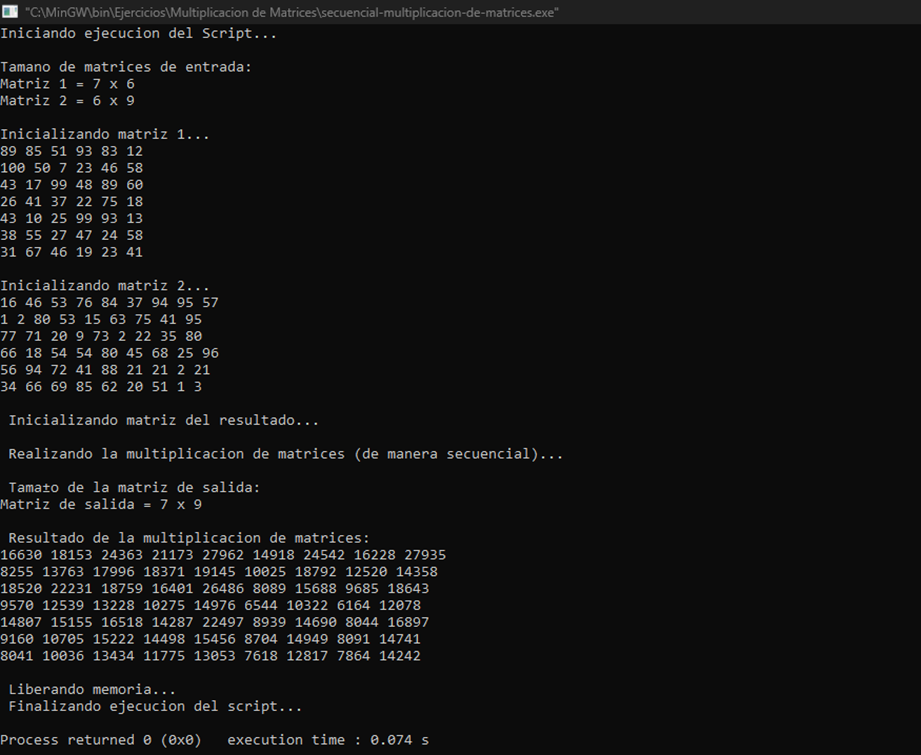
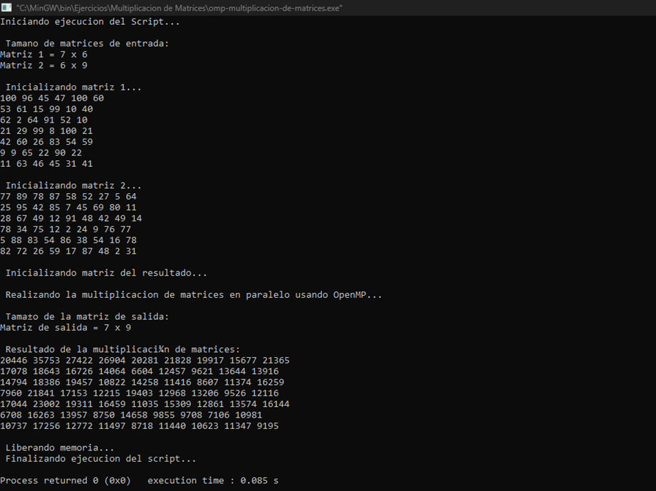
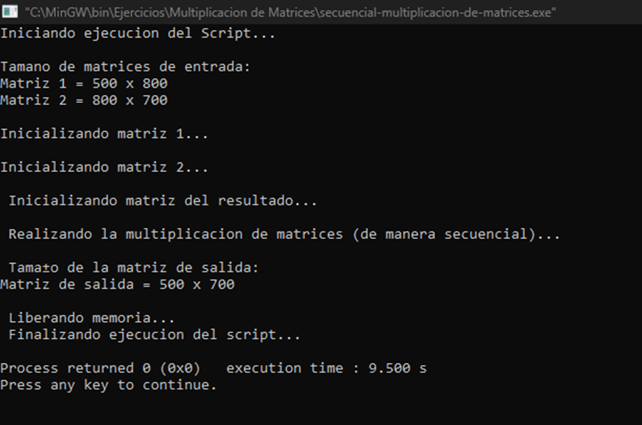
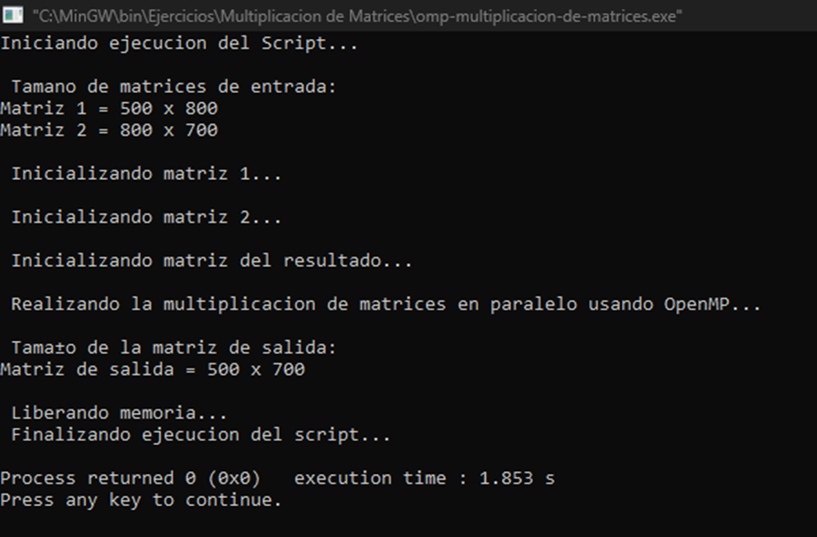
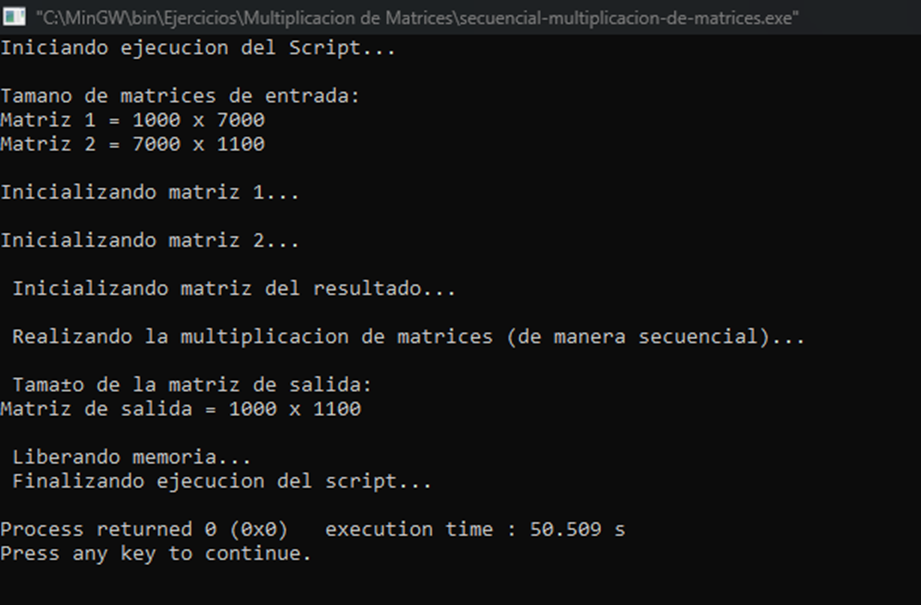
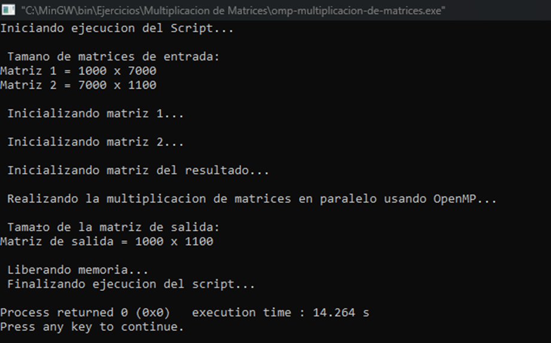

# Multiplicacion de Matrices

### Andres Valenzuela - Codigo:2190035 - Problema B: Multiplicación de Matrices
En la carpeta presente encontrara los diferentes archivos correspondientes a cada una de las soluciones del problema: solucion secuencial y solucion paralela. El programa cuenta con la capacidad de multiplicar matrices tanto cuadradas (NxN * NxN), como no cuadradas (MxN * N*P), dichas dimensiones se pueden ajustar en las lineas 6, 7 y 8 de cada unos de los codigos en C:

Ademas, los valores de cada una de las posiciones de las matrices son numeros aleatorios generados en un rando de 0 a 100, tal y como se puede observar en las lineas 38 y 47:

Como ultimo antes de pasar a los resultados obtenidos y su respectivo analisis, tambien es importante destacar que la complejidad de la prueba 
no radica en los valores contenidos en las matrices sino en las dimensiones de estas, es decir, aumentamos los tamaños para que la complejidad radique en una mayor cantidad de operaciones, no en operaciones con numeros mas grandes. Para este fin fue necesario trabajar con una asignacion de memoria dinamica para las matrices (punteros en vez de variables 'localizadas'), esto debido a que con matrices con dimensiones mayores a 100 x 100, el sistema presentaba un problema por falta de memoria (desbordamiento de pila).

## Pruebas

### Prueba #1 
Para la primera prueba se usaron las siguientes matrices:
Matriz 1 = 7x6
Matriz 2 = 6x9

#### Programa con ejecucion secuencial:

#### Programa con ejecucion paralela:

Como se puede observar, con matrices cuyas dimensiones son pequeñas los tiempos de ejcucion son bastante similares, incluso la ejecucion secuencial obtiene mejores resultados (aunque no por mucho).

### Prueba #2 
Para la primera prueba se usaron las siguientes matrices:
Matriz 1 = 500x800
Matriz 2 = 800x700

#### Programa con ejecucion secuencial:

#### Programa con ejecucion paralela:

Por conveniencia de la impresion en consola, en esta y la siguiente prueba no se imprimiran las matrices generadas debido a su considerable tamaño.
En este caso podemos notar una diferencia considerable, ya que el programa secuencial termina su ejecucion en 9.5 segundos, mientras que la ejecucion paralela termina en 1.853 segundos, una diferencia considerable.

### Prueba #3
Para la primera prueba se usaron las siguientes matrices:
Matriz 1 = 1000x7000
Matriz 2 = 700x1100

#### Programa con ejecucion secuencial:

#### Programa con ejecucion paralela:

Conforme aumentan las dimensiones de las matrices, la ejecucion se torna mas compleja, es a partir de aqui donde la ejecucion en paralelo le toma ventaja a la ejecucion secuencial, ya que mientras que la paralela le toma 14.264 segundos en terminar la ejecucion, la secuencial le toma 50.509 segundos, es decir mas de 3 veces en tiempo de ejecucion.

### Conclusion
En matrices con niveles de complejidad bajos la programacion secuencial y la paralela estan practicamente al mismo nivel, sin embargo a medida que la complejidad aumenta, la programacion paralela cuenta con una mejor forma de resolver los problemas cuya carga es considerablemente grande. 

